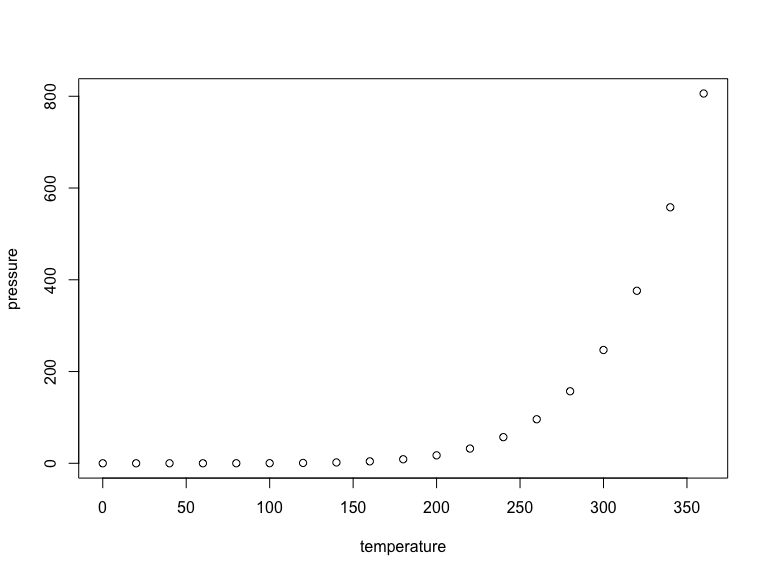

## Big Idea

- Current model is a lot of economics, but I feel like I've lost what the model is tied to in real life.

- I will propose a motivating example and an idea for model it.

## More on Motivation:

### Some technical problems in the model I've been building

- A few problems with the model I was building
  - Durable goods not addressed
  - Assumption that increased sales decrease reputation
  - Media streaming should be modeled with a time constraint (not budget)
  
### Bigger picture problem
  
- Other problem, I don't know what my model models. 
  - At least it doesn't feel like art markets these days truly behave this way
  - I'm stuck on the fact that most artists these days don't really have control over how many plays/views their content gets 
  
## Pivoting to a new model

### What's actually interesting to me

- Artists (content creators) express immense frustration with "the algorithm"
- Artists make similar quality products and reach very different audiences
- Consumers don't pay for art anymore, so what motivates artists to produce good work?
  - Big audience $\implies$ big advertising revenue
- Audience is a gossamer melange of earned reputation and "the algorithm"
  - How should an artist expend effort with uncertain returns? 

## Pivoting to a new model, cont.

### A More Precise Motivating Example

- An artist is making music to release on Spotify and other streaming platforms
- An artist can control the quality of the music they produce
- Artists get a dollar amount per stream, but producing high quality music is costly (in the present)
- The "algorithm" decides how many people to show the artist's work to
  - Algorithmic audience size is stochastic in the eyes of the producer
  - Once audience size is determined, consumption is deterministic
  - We know that the algorithm shows content more when more people watch (critical mass)
- The artist's problem is to optimize the tradeoff between a costly quality high quality product and lower potential revenues from a low quality product

## Modelling Avenues

### Sequential Modeling

- Period 1: A producer releases an art piece
- Period 2: A stochastic number of consumers are showed this art and consume an amount of the art according to some simple demand curve that inputs only the quality of the art
- Period 3: Producer makes a new art piece and previous
- Period 4: Somehow, last period's consumption is factored into the stochastic audience variable
- Repeat 3 and 4

### $SIR$/Penetration Curve
- We enter period $t$ with some proportion of *susceptible* who have never experienced an artist's work, some *infected* and some *recovered*
- Each of these groups will have different consumption rates and would affect the $S,I, \& R$ of the next period.
- This feels super tractable (or at least easy to write down)
- However this gets rid of the role of an algorithm

## Expectations for a new model
 - I think this should reproduce convexity of profits in talent (à la Rosen)
 - Bad luck forcing certain artists out of the market


## Slide with R Output


```r
summary(cars)
```

```
##      speed           dist       
##  Min.   : 4.0   Min.   :  2.00  
##  1st Qu.:12.0   1st Qu.: 26.00  
##  Median :15.0   Median : 36.00  
##  Mean   :15.4   Mean   : 42.98  
##  3rd Qu.:19.0   3rd Qu.: 56.00  
##  Max.   :25.0   Max.   :120.00
```

## Slide with Plot

<!-- -->

